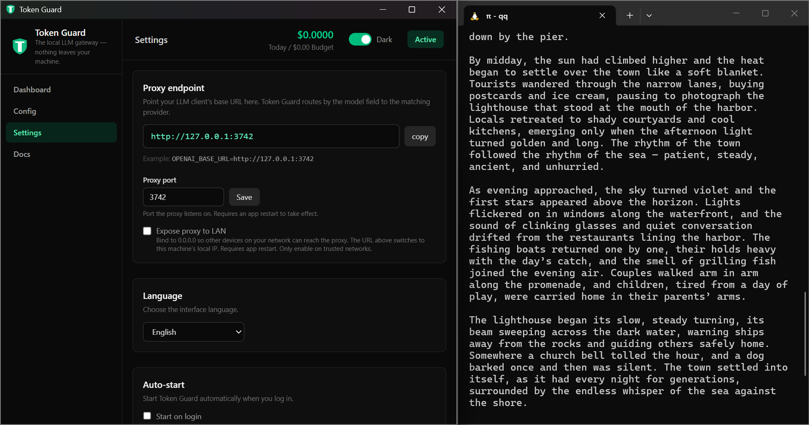

# Token Guard

[](https://github.com/QQSHI13/tokenguard/releases)
[](https://github.com/QQSHI13/tokenguard/actions/workflows/ci.yml)
[](LICENSE)
[](https://github.com/QQSHI13/tokenguard/releases)

> The local LLM gateway. Your keys, your machine, your tokens.

> [!NOTE]
> 🎁 **Launch offer:** the first 20 people to email **qingquanshi65@gmail.com** with feedback on Token Guard get a **free Pro license** (no banner, automatic updates, up to 2 devices).

A local LLM gateway (Tauri v2 + Rust) with a desktop GUI and a headless CLI.
It runs a local HTTP proxy to intercept and log LLM API calls, converts between
major SDK formats, and shows real-time cost in the system tray or terminal.

**Docs:** [project wiki](https://github.com/QQSHI13/tokenguard/wiki) (English + 中文) · **Website:** [tokenguard.pages.dev](https://tokenguard.pages.dev) · **Community:** [Discussions](https://github.com/QQSHI13/tokenguard/discussions)

**The only LLM cost monitor that *cannot* see your prompts.** No cloud, no
account, no telemetry. The proxy forwards bytes to the provider you already call
and records only metadata (tokens, model, cost) to a local SQLite database.

<p align="center">
  
</p>

## What makes Token Guard different

- **4 × 4 SDK conversion.** Use OpenAI Chat, OpenAI Responses, Anthropic Messages,
  or Gemini client code, and route any of those four shapes to any supported
  provider. Requests, responses, and SSE streams are translated on the fly.
- **API keys in the OS keychain.** Provider keys are stored in Windows Credential
  Manager, macOS Keychain, or Linux Secret Service — not in `~/.cursorrc`, not in
  an `.env` file, and not in Token Guard's SQLite database.
- **Projects, budgets, and smart limits.** Tag requests by project, set per-project
  budgets, and enforce limits on money, tokens, requests, RPM, TPM, or elapsed time.
  Scope limits globally, per provider, or per project; schedule active hours and
  days; choose warn, block, or pause on breach.
- **Real-time cost tracking.** Per-project, per-provider, per-model spend with a
  local SQLite history. Built-in pricing table plus per-model overrides; no network
  calls to look up prices. Supports context-window tiers, UTC peak/off-peak
  windows, cached-input discounts, reasoning-token pricing, batch discounts,
  and flat request fees.
- **GUI + CLI, same engine.** Configure everything in the desktop tray app or run
  headless with the `tokenguard` CLI. Both use the same Rust backend and the same
  local database.

## Architecture

| Layer | Tech |
|---|---|
| Shell | Tauri v2 (native tray, webview settings window) |
| Proxy | Rust — axum server + reqwest streaming client |
| DB | SQLite (rusqlite, WAL) — local-first |
| Secrets | OS keychain via `keyring` (Win Credential Manager / macOS Keychain / Linux Secret Service) |
| Frontend | React 19 + Tailwind v4 (settings/dashboard only) |

## Routing

One base URL (`http://127.0.0.1:3742`). Requests are routed to a provider by the
`model` field in the request body, within the endpoint's format family:

- `/v1/chat/completions` and `/v1/responses` → OpenAI-format providers
- `/v1/completions` → OpenAI legacy completions
- `/v1/messages` → Anthropic Messages API
- `/v1beta/models/{model}:generateContent` and `:streamGenerateContent` → Gemini
  API (streaming via the method suffix or `?alt=sse`; `GET /v1beta/models` and
  `/v1beta/models/{model}` also work)

Falls back to the default provider for that family. `GET /v1/models` returns the
merged local model list.

### 4 × 4 format conversion

Send requests in any of the four supported SDK shapes; Token Guard routes and
rewrites them for any configured provider in the matching format family:

| Client shape → Provider format | OpenAI Chat | OpenAI Responses | Anthropic Messages | Gemini |
|---|---|---|---|---|
| **OpenAI Chat** provider | ✓ | converted | converted | converted |
| **OpenAI Responses** provider | converted | ✓ | converted | converted |
| **Anthropic Messages** provider | converted | converted | ✓ | converted |
| **Gemini** provider | converted | converted | converted | ✓ |

Requests, responses, and SSE streams are translated on the fly, including tool
calls, images, and cached-token pricing metadata.

**Universal provider support:** Token Guard ships with native OpenAI, Anthropic,
Gemini, and OpenAI Responses formats. Any OpenAI-compatible endpoint (local
models, OpenAI-compatible proxies, custom base URLs) can be registered as an
OpenAI-format provider without code changes.

### Model aliases

Each provider model has a **local name** (what you send) and an optional
**provider/remote name** (what the upstream API expects). For example, you can
send `"model": "claude-sonnet-4"` locally while the proxy forwards it as
`claude-sonnet-4-20250514` to Anthropic.

## Build & run

Requires: Rust (stable, MSVC on Windows), Node 18+, WebView2 (Windows).

```bash
npm install
cargo tauri dev
```

First run builds the Rust backend (slow). A window + green shield tray icon
appear. Add a provider in the **Providers** tab, then point any OpenAI-compatible
client at `http://localhost:3742`:

```bash
OPENAI_BASE_URL=http://localhost:3742/v1
OPENAI_API_KEY=<your-project-label-key>   # set this to a project's label key from Token Guard
```

### Headless CLI

Token Guard also ships as a full command-line tool. Install it without the GUI:

**macOS / Linux**
```bash
curl -fsSL https://raw.githubusercontent.com/QQSHI13/tokenguard/main/scripts/install-cli.sh | bash
# latest beta:
curl -fsSL .../install-cli.sh | bash -s -- --beta
```

**Windows (PowerShell)**
```powershell
irm https://raw.githubusercontent.com/QQSHI13/tokenguard/main/scripts/install-cli.ps1 | iex
# latest beta:
irm .../install-cli.ps1 | iex "& { $() } -Beta"
```

Run the proxy (or see help by running `tokenguard` alone):
```bash
tokenguard start
```

The CLI is interactive: run a command without the required options and it will
prompt you. You can still script everything with explicit flags.

```bash
# status
tokenguard status

# proxy control
tokenguard proxy pause
tokenguard proxy resume
tokenguard proxy toggle

# providers (interactive: tokenguard provider add)
tokenguard provider add --name openai --base-url https://api.openai.com/v1 \
  --format openai --key $OPENAI_KEY --auth bearer --default \
  --model gpt-4o=gpt-4o:5.0:15.0
tokenguard provider update 1 --base-url https://new-endpoint.example/v1
tokenguard provider set-key openai $OPENAI_KEY
tokenguard provider refresh-models 1
tokenguard models
tokenguard health

# projects (interactive: tokenguard project add)
tokenguard project add --name my-app --label-key tg-myapp \
  --budget 10 --budget-period daily --budget-action pause

# limits (interactive: tokenguard limit add)
tokenguard limit add --name "daily-tokens" --metric tokens --cap 1000000 \
  --action pause --period daily --warning-threshold 0.9 --scope global
tokenguard limit status
tokenguard limit update 1 --cap 2000000 --enabled true

# settings
tokenguard settings show
tokenguard settings set-port 3742
tokenguard settings set-expose-to-lan true
tokenguard settings set-beta-channel true
tokenguard settings set-log-retention 30
tokenguard settings cleanup-logs
tokenguard settings auto-export set 7 /path/to/exports
tokenguard settings auto-export run-now
tokenguard settings test-webhook

# license
tokenguard license show
tokenguard license activate XXXX-XXXX-XXXX-XXXX
tokenguard license fingerprint
tokenguard license devices

# update (requires license; --beta for pre-releases)
tokenguard update check
tokenguard update check --beta
tokenguard update download --output ./tokenguard.new
tokenguard update download --beta --output ./tokenguard.new

# usage, logs, backup
tokenguard usage monthly
tokenguard usage provider openai --days 7
tokenguard logs export --output usage.csv --days 30
tokenguard logs query --provider openai --page 1 --page-size 20
tokenguard backup create ./tokenguard-$(date +%F).db
```

### Keychain note

Token Guard stores API keys in the OS keychain:

- **Windows** → Credential Manager
- **macOS** → Keychain
- **Linux/WSL** → D-Bus Secret Service

If the in-app **Test keychain** button fails with *“No matching entry found in
secure storage”*:

- On **Windows**: ensure the *Credential Manager* service is running and you are
  not inside a sandbox/container that blocks Win32 credential APIs.
- On **macOS**: ensure Keychain Access is available and the app has keychain
  entitlements.
- On **Linux/WSL**: install and start a secret-service provider:
  - GNOME Keyring: `sudo apt install gnome-keyring` then
    `gnome-keyring-daemon --start --components=secrets`.
  - KeePassXC with secret-service integration enabled.
  - KWallet with the secret-service interface enabled.

**Note:** If you synced the repo from a Linux/WSL shell but are running
`cargo tauri dev` inside WSL, the compiled binary is a Linux binary and needs a
Linux secret-service provider. To use Windows Credential Manager, build and run
from PowerShell or CMD on Windows.

## Cost accuracy

Cost estimates use a built-in pricing table (`pricing.json`) that is embedded
into the binary at build time. The table supports several real-world pricing
dimensions:

- **Context-window tiers** — e.g. Gemini Pro's cheaper rate for prompts up to
  200K tokens and a higher rate above it.
- **UTC peak / off-peak windows** — e.g. DeepSeek V4 Flash is 2× during peak
  hours (01:00–04:00 and 06:00–10:00 UTC) and half price at other times.
- **Cached-input discounts** and **reasoning-token pricing** extracted from
  provider SSE streams.
- **Batch discounts** and **flat request fees** for per-image or minimum
  charges.

Provider pricing changes frequently, so the estimate may drift until you set
exact per-model prices in **Settings**. Token Guard never fetches pricing from
the internet at runtime.

## Limits & subscriptions

The **Limits** tab lets you set caps on:

- **Money** ($)
- **Tokens** (prompt + completion)
- **Requests** (count)
- **Time** (wall-clock seconds)

Each limit has a reset period (one-time, hourly, daily, weekly, monthly, or
custom seconds) and can be scoped globally, per provider, or per project.
When a limit is exceeded you can choose to:

- **Warn** — log and color the tray icon.
- **Block** — return HTTP 429 for subsequent requests.
- **Pause** — pause the proxy until you resume it.

This covers subscription-style APIs such as "5 hours per day", "1 000 requests
per day", or "1 M tokens per month". The legacy daily budget is automatically
migrated to a global daily money limit.

## Status

v0.2.0-beta.4 — active development. Core proxy + 4 × 4 model routing + SSE passthrough +
logging + GUI tray app + headless CLI + limits + projects + provider health +
license/device management. See `PRIVACY.md` for how user data is handled.

## License

Apache-2.0. See `LICENSE`.
